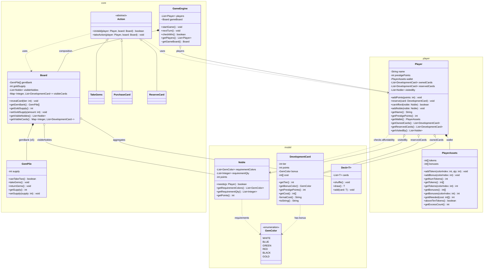

## Package: `com.splendor.core`

> Contains the core game loop and the board state.

IMPORTANT 
Standard indexing for all token arrays: [0] white [1] blue [2] green [3] red [4] black

### `GameEngine`

|Visibility|Member|Type|
|:-:|:--|:--|
|`-`|`players`|`List<Player>`|
|`~`|`gameBoard`|`Board`|
|`+`|`startGame()`|`void`|
|`+`|`nextTurn()`|`void`|
|`+`|`checkWin()`|`boolean`|
|`+`|`getPlayers()`|`List<Player>`|
|`~`|`getGameBoard()`|`Board`|

### `GemPile`

| Visibility | Member                   | Type      |
| :--------: | :----------------------- | :-------- |
|    `-`     | `supply`                 | `int`     |
|    `+`     | `canTakeTwo()`           | `boolean` |
|    `+`     | `takeGems()`             | `void`    |
|    `+`     | `returnGems()`           | `void`    |
|    `+`     | `getSupply()`            | `int`     |
no need setSupply() because the supply is handled through takeGems() and returnGems()

### `Board`

| Visibility | Member                       | Type                                  |
| :--------: | :--------------------------- | :------------------------------------ |
|    `-`     | `gemBank`                    | `GemPile[]`                           |
|    `-`     | `goldSupply`                 | `int` (starts at 5)                   |
|    `-`     | `allCards`                   | `Map<Integer, Deck<DevelopmentCard>>` |
|    `-`     | `visibleNobles`              | `List<Noble>`                         |
|    `-`     | `visibleCards`               | `Map<Integer, List<DevelopmentCard>>` |
|    `+`     | `revealCard(tier: int)`      | `void`                                |
|    `+`     | `getGemBank()`               | `GemPile[]`                           |
|    `+`     | `getGoldSupply()`            | `int`                                 |
|    `+`     | `setGoldSupply(amount: int)` | `void`                                |
|    `+`     | `getVisibleNobles()`         | `List<Noble>`                         |
|    `+`     | `getVisibleCards()`          | `Map<Integer, List<DevelopmentCard>>` |
|    `+`     | `getAllCards()`              | `Map<Integer, Deck<DevelopmentCard>>` |

### `Action` _(Abstract)_

|Visibility|Method|Returns|
|:-:|:--|:--|
|`+`|`isValid(player: Player, board: Board)`|`boolean`|
|`+`|`takeAction(player: Player, board: Board)`|`void`|

### Action Implementations

Concrete classes: **`TakeGems`**, **`PurchaseCard`**, **`ReserveCard`**

Each class `extends Action` and provides full implementations of:

- `isValid(player: Player, board: Board): boolean`
- `takeAction(player: Player, board: Board): void`

```
Action  (abstract)
├── TakeGems
├── PurchaseCard
└── ReserveCard
```

---

## Package: `com.splendor.model`

> Contains physical game components and entities. All classes in this package are **immutable** — no setters.

### `GemColor` _(enum)_

```java
enum GemColor {
    WHITE,  // index 0
    BLUE,   // index 1
    GREEN,  // index 2
    RED,    // index 3
    BLACK,  // index 4
    GOLD    // separate — not in token arrays
}
```

### `DevelopmentCard`

|Visibility|Member|Type|
|:-:|:--|:--|
|`-`|`tier`|`int`|
|`-`|`points`|`int`|
|`-`|`bonus`|`GemColor`|
|`-`|`cost`|`int[]`|
|`+`|`getTier()`|`int`|
|`+`|`getBonusColor()`|`GemColor`|
|`+`|`getPrestigePoints()`|`int`|
|`+`|`getCost()`|`int[]`|
|`-`|`formatCost()`|`String`|
|`+`|`toString()`|`String`|

### `Noble`

|Visibility|Member|Type|
|:-:|:--|:--|
|`-`|`requirementColors`|`List<GemColor>`|
|`-`|`requirementQty`|`List<Integer>`|
|`-`|`points`|`int`|
|`+`|`needs(p: Player)`|`boolean`|
|`+`|`getRequirementColors()`|`List<GemColor>`|
|`+`|`getRequirementQty()`|`List<Integer>`|
|`+`|`getPoints()`|`int`|

### `Deck<T>`

> No getters/setters — all interaction is through `shuffle()`, `draw()`, `add()`. Exposing the raw `cards` list directly would break encapsulation.

|Visibility|Member|Type|
|:-:|:--|:--|
|`-`|`cards`|`List<T>`|
|`+`|`shuffle()`|`void`|
|`+`|`draw()`|`T`|
|`+`|`add(card: T)`|`void`|

---

## Package: `com.splendor.player`

> Manages player state, assets, and inventory.

### `PlayerAssets`

| Visibility | Member                                | Type      |
| :--------: | :------------------------------------ | :-------- |
|    `-`     | `tokens`                              | `int[]`   |
|    `-`     | `goldTokens`                          | `int`     |
|    `-`     | `bonuses`                             | `int[]`   |
|    `+`     | `addToken(colorIndex: int, qty: int)` | `void`    |
|    `+`     | `addBonus(colorIndex: int)`           | `void`    |
|    `+`     | `addGoldToken()`                      | `void`    |
|    `+`     | `useGoldToken()`                      | `void`    |
|    `+`     | `getNumTokens()`                      | `int`     |
|    `+`     | `getTokens()`                         | `int[]`   |
|    `+`     | `getTokens(colorIndex: int)`          | `int`     |
|    `+`     | `getGoldTokens()`                     | `int`     |
|    `+`     | `getBonuses()`                        | `int[]`   |
|    `+`     | `getBonuses(colorIndex: int)`         | `int`     |
|    `+`     | `goldNeeded(cost: int[])`             | `int`     |
|    `+`     | `aboveTenTokens()`                    | `boolean` |
|    `+`     | `getExcessCount()`                    | `int`     |

> `getNumTokens()` returns total across all 5 colours **plus** `goldTokens` (gold counts toward the 10-token limit). Added `useGoldToken()` alongside `addGoldToken()` — needed for when gold is spent during `PurchaseCard`.

### `Player`

| Visibility | Member                           | Type                    |
| :--------: | :------------------------------- | :---------------------- |
|    `-`     | `name`                           | `String`                |
|    `-`     | `prestigePoints`                 | `int`                   |
|    `-`     | `wallet`                         | `PlayerAssets`          |
|    `-`     | `ownedCards`                     | `List<DevelopmentCard>` |
|    `-`     | `reservedCards`                  | `List<DevelopmentCard>` |
|    `-`     | `visitedBy`                      | `List<Noble>`           |
|    `+`     | `addPoints(points: int)`         | `void`                  |
|    `+`     | `reserve(card: DevelopmentCard)` | `void`                  |
|    `+`     | `canAfford(noble: Noble)`        | `boolean`               |
|    `+`     | `addNoble(noble: Noble)`         | `void`                  |
|    `+`     | `getName()`                      | `String`                |
|    `+`     | `getPrestigePoints()`            | `int`                   |
|    `+`     | `getWallet()`                    | `PlayerAssets`          |
|    `+`     | `getOwnedCards()`                | `List<DevelopmentCard>` |
|    `+`     | `getReservedCards()`             | `List<DevelopmentCard>` |
|    `+`     | `getVisitedBy()`                 | `List<Noble>`           |

> No setters for list fields — mutations go through `addPoints()`, `reserve()`, `addNoble()`.

---

## Structural Relationships

|Relationship|Owner|Target|Notes|
|:--|:--|:--|:--|
|**Composition**|`GameEngine`|`Board`|`Board` exists only within an active game|
|**Composition**|`Board`|`GemPile`|5 `GemPile` instances (one per non-gold colour)|
|**Aggregation**|`Board`|`Deck`|`Deck` exists independently; `Board` holds it during play|
|**Implementation**|`TakeGems`, `PurchaseCard`, `ReserveCard`|`Action`|Concrete classes providing logic for the abstract base|

---

## Functional Dependencies

> _"Uses-a" relationships where one class requires knowledge of another._

|Class|Depends On|Reason|
|:--|:--|:--|
|`Player`|`Noble`, `DevelopmentCard`|Affordability checks and inventory|
|`DevelopmentCard`|`GemColor`|Bonus gem type|
|`Noble`|`GemColor`|Cost requirement colors|
|`Board`|`Noble`|Tracking available visitors|
|`Action`|`Board`|Validation and execution context|
|`GameEngine`|`Action`|Processing player moves|

---

## UML Class Diagram

